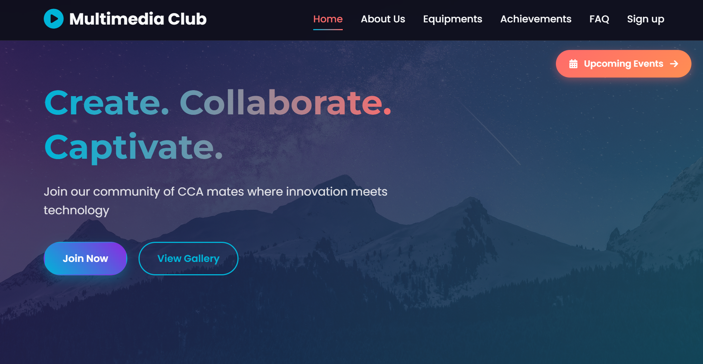

# UX/UI Project — Y1 S1

This repository contains my UX/UI design project from Year 1, Semester 1 — awarded a **Distinction**.

## 🧠 Overview

This project documents the complete UX design process from user research and wireframing to UI prototyping. The focus is on creating a user-centered experience with clear visual hierarchy, usability, and accessible design decisions.

## 🎯 Goals

- Understand user needs and pain points
- Create clear user flows and intuitive layouts
- Produce high-fidelity UI designs
- Validate design decisions with UX principles

## 🛠 Tools Used

- Figma (or your specific tool)
- Any other design / prototyping tools

## 📄 Contents

- Wireframes
- User flows
- UI mockups
- Prototype assets

## 🏆 Achievement

⚡ **Project awarded Distinction** for strong UX thinking, clear rationale, and polished UI.

---

Feel free to explore the repo and view design files.

